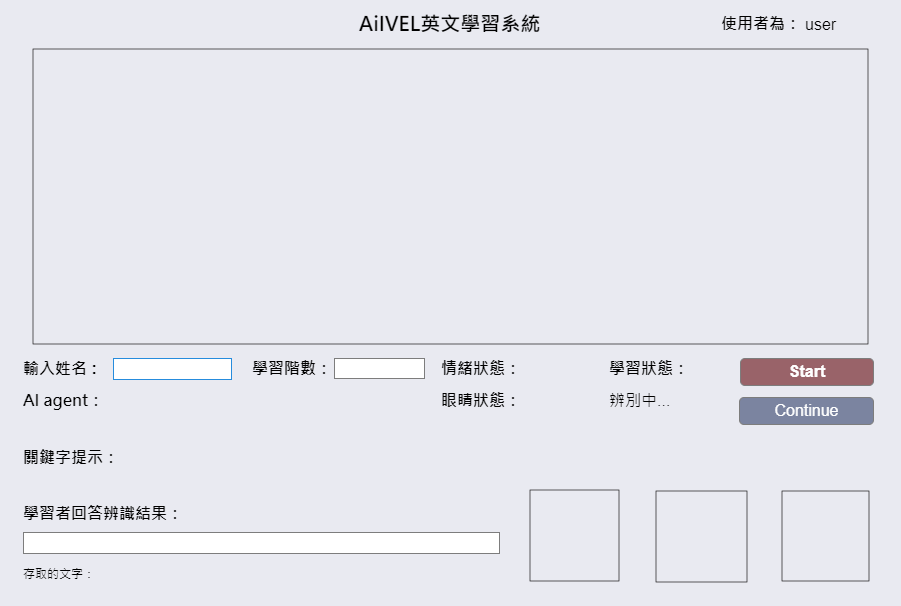

# AIiVEL: AI-Adaptive English Learning System

An archived MATLAB App Designer project that adapts English listening practice using multimodal learner signals. The prototype plays level-based video exercises and combines webcam, microphone, pose, face, emotion, and eye-state signals to support an adaptive learning flow.

> Built as a university capstone project (June 2023 – February 2024). This repository is a cleaned portfolio release: personal recordings, learner logs, training images, and pretrained model files are intentionally excluded.



**Code review:** GitHub cannot render App Designer's `.mlapp` package directly. The same final application source is therefore exported in readable form at [`src/AiIVEL_fianl.m`](src/AiIVEL_fianl.m).

## What it demonstrates

- **Adaptive practice flow** — presents level-based English video exercises and changes the next activity based on the learner's progress.
- **Multimodal interaction** — captures webcam and microphone input while a learning task is in progress.
- **Computer vision integration** — connects pose estimation, face detection, facial-emotion recognition, and eye-state classification within a MATLAB App Designer interface.
- **Learning analytics** — the original prototype recorded timing and keyword-spotting results for reviewing learner progress.

## Project outcome

The eye-state image-classification work expanded the training image set from **240 to 960 images** and achieved **99.17% accuracy** in the project evaluation. This repository contains the application source only; the training data and model weights are not distributed.

## Repository layout

```text
.
├── app/
│   └── AiIVEL.mlapp          # Final MATLAB App Designer application
├── assets/
│   └── app-preview.png       # Interface preview exported from the app
├── src/
│   └── AiIVEL_fianl.m        # Readable export of the App Designer source
├── README.md
├── THIRD_PARTY_NOTICES.md
└── .gitignore
```

## Requirements

The project was developed with **MATLAB R2023b** and App Designer. Running the original prototype also requires a webcam, microphone, local practice videos, and the original trained model files.

Expected MATLAB products/toolboxes include:

- MATLAB and App Designer
- Computer Vision Toolbox
- Deep Learning Toolbox
- Image Acquisition Toolbox Support Package for USB Webcams
- Audio Toolbox / audio recording support

The original development setup additionally used a MATLAB pose-estimation package and MathWorks face-detection example components. Those third-party dependencies and their model files are not bundled here.

## Run the app

1. Open `app/AiIVEL.mlapp` in MATLAB R2023b or a compatible newer release.
2. In App Designer, inspect the callback paths and provide your own local practice videos and model files.
3. Install the required MATLAB toolboxes and configure a webcam and microphone.
4. Run the app from App Designer.

This archived source reflects the final demonstration environment, rather than a packaged production release. Refactoring hard-coded paths and separating the vision pipelines into reusable modules would be the next step for a fully reproducible version.

## Privacy and repository policy

The repository intentionally excludes:

- learner videos, webcam captures, and audio recordings;
- learner-result spreadsheets and any personally identifying study logs;
- training images and trained network/model artifacts;
- generated MATLAB project files, caches, and packaged example dependencies.

## Attribution

Parts of the original development environment used MathWorks example material and MATLAB tooling. See [THIRD_PARTY_NOTICES.md](THIRD_PARTY_NOTICES.md) for the applicable attribution and usage notes.
